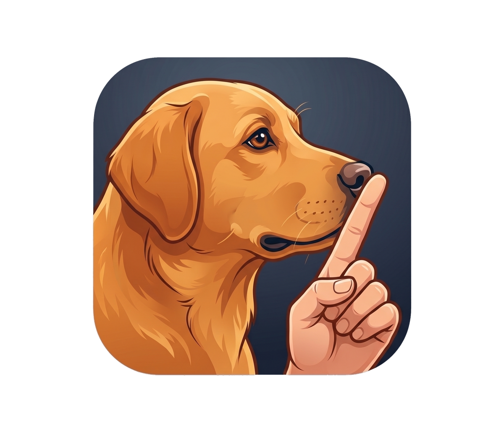
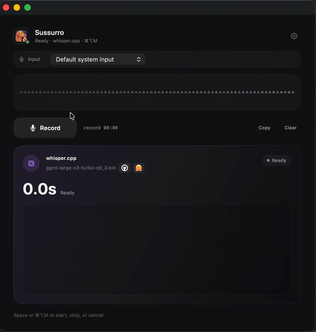

<p align="center">
  
</p>

# Sussurro

A small offline macOS speech-to-text app powered by [whisper.cpp](https://github.com/ggml-org/whisper.cpp) written in Swift.

**Contents**

- [Demo](#demo)
- [How to run](#how-to-run)
  - [Install](#install)
  - [Open](#open)
  - [Run without installing](#run-without-installing)
- [First-time setup](#first-time-setup)
- [How to use](#how-to-use)
- [Features](#features)
- [Privacy and safety](#privacy-and-safety)
- [Models](#models)
- [Paths](#paths)
- [Troubleshooting](#troubleshooting)
- [License](#license)

## Demo



## How to run

### Install

```bash
git clone https://github.com/ocodista/sussurro.git
cd sussurro
scripts/install-app.sh
```

`install-app.sh` builds bundled whisper.cpp, builds the app, and installs it to `/Applications/Sussurro.app` when possible. Otherwise, it installs to `~/Applications/Sussurro.app`. It signs source builds with a stable local ad-hoc requirement so macOS privacy grants survive rebuilds. Building from source requires Xcode command line tools, Git, and CMake; running the built app does not require Homebrew.

### Open

```bash
open -a Sussurro
```

Allow microphone access on first launch.

### Run without installing

```bash
scripts/run.sh
```

`run.sh` also builds the local bundled whisper.cpp CLI when needed.

## First-time setup

Open **Sussurro → Settings…** or click the gear button.

Sussurro ships with bundled [`whisper.cpp`](https://github.com/ggml-org/whisper.cpp) and the recommended GGML Whisper model, so Homebrew is not required for transcription.

Advanced users can override the bundled CLI/model paths or download alternate models from Settings.

## How to use

1. Choose an input, or keep **Default system input**.
2. Choose **Dictation** for microphone-only notes or **Meeting** for a two-person call.
3. Press **Record** / **Start Meeting**, space, or **⌘⌥M**.
4. Speak.
5. Press **Stop**, space, or **⌘⌥M**.
6. Wait for transcription. Sussurro copies the result to the clipboard.

Meeting mode records the microphone as **Person A** and local system audio as **Person B**, then merges the two local whisper.cpp transcripts chronologically without summarizing or rewriting the words. Use headphones to reduce speaker bleed between streams.

## Features

- floating recorder window with input picker, recording mode picker, and waveform
- meeting mode that captures microphone + system audio locally and labels a two-person call as Person A/Person B
- SQLite-backed audio and transcript history for reviewing and retrying failed or long transcriptions
- local transcription through bundled `whisper.cpp`
- bundled recommended Whisper model, with optional model download and path overrides
- transcription status, duration, and language display
- clipboard copy and diagnostic command logs

## Privacy and safety

- Transcription runs locally through bundled `whisper.cpp`; Sussurro does not send audio or transcripts to an app server.
- Meeting mode captures microphone and system audio locally. System audio capture may require macOS System Audio Recording permission.
- Recordings are stored locally in `~/Library/Application Support/Sussurro/Recordings/` until you delete them.
- Successful transcripts are copied to the macOS clipboard, where other apps may be able to read them.
- Transcript history is stored locally in SQLite at `~/Library/Application Support/Sussurro/history.sqlite` so you can review and retry previous audio.
- Diagnostic logs intentionally omit transcript text. They keep command metadata and `whisper-cli` stderr for troubleshooting.

## Models

Bundled default model: [`ggml-large-v3-turbo-q5_0.bin`](https://huggingface.co/ggerganov/whisper.cpp/blob/main/ggml-large-v3-turbo-q5_0.bin).

Model source: [`ggerganov/whisper.cpp` on Hugging Face](https://huggingface.co/ggerganov/whisper.cpp).

Presets:

- `turbo` — recommended quality/speed balance
- `base` — smallest and fastest, with lower accuracy
- `small` — middle ground

## Paths

- bundled whisper.cpp CLI: `Sussurro.app/Contents/MacOS/whisper-cli`
- bundled models: `Sussurro.app/Contents/Resources/Models/`
- downloaded models: `~/Library/Application Support/Sussurro/Models/`
- recordings: `~/Library/Application Support/Sussurro/Recordings/`
- history database: `~/Library/Application Support/Sussurro/history.sqlite`
- logs: `~/Library/Logs/Sussurro/`
- latest transcription log: `~/Library/Logs/Sussurro/whisper-last.log`

## Troubleshooting

Open the latest command log:

```bash
cat "$HOME/Library/Logs/Sussurro/whisper-last.log"
```

Common fixes when building from source:

```bash
scripts/install-deps.sh turbo
scripts/build-app.sh
```

If Meeting mode says System Audio Recording is missing while Sussurro is enabled, reset the stale macOS privacy grant and grant it again:

```bash
tccutil reset AudioCapture com.ocodista.sussurro
scripts/install-app.sh
```

## License

MIT. See [LICENSE](LICENSE).
