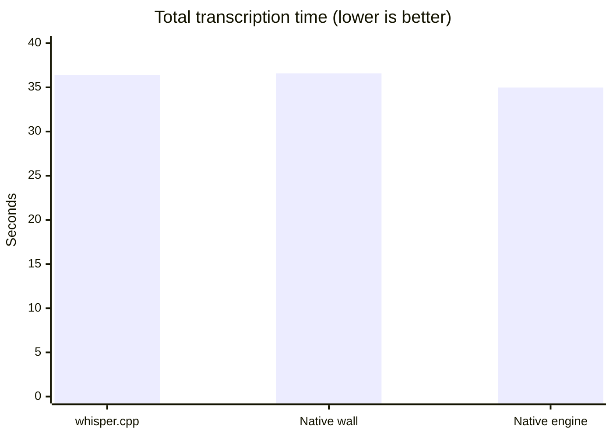

# whisper.cpp vs macOS SpeechTranscriber

## Setup

| Item | Value |
|---|---|
| macOS | 26.2 |
| CPU | arm64 |
| Audio | 13 recordings, 444.6s total |
| whisper.cpp | `/opt/homebrew/bin/whisper-cli` |
| Whisper model | `ggml-large-v3-turbo-q5_0.bin` |
| Native API | `SpeechAnalyzer` + `SpeechTranscriber` |

## Results

| Backend | Total time | Realtime factor | Notes |
|---|---:|---:|---|
| `whisper.cpp` | 36.41s | 0.0819x | Best quality in this sample |
| macOS native, wall time | 36.58s | 0.0823x | Roughly tied |
| macOS native, engine time | 34.98s | 0.0787x | Slightly faster without CLI overhead |

Speed was effectively tied. Native may be slightly faster when integrated directly in the app.

## Quality

Native worked well on clean English dictation. It struggled more with technical terms and mixed Portuguese/English.

Examples where `whisper.cpp` did better:

- `React TypeScript`
- `Tailwind CSS`
- `shadcn`
- `Cloudflare`
- `R2 and D1`

Native also requires an explicit locale. `whisper.cpp` currently uses `-l auto` and detects the language.

## Trade-offs

macOS native transcription offers:

- zero-setup local transcription
- live/progressive transcription UI
- no bundled or user-managed GGML model

`whisper.cpp` offers:

- macOS 13–25 support
- automatic language detection
- stronger technical dictation in this sample
- broader language support
